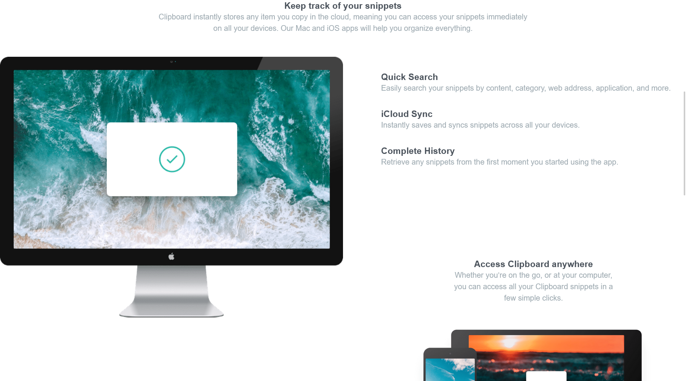

# Frontend Mentor - Clipboard landing page solution

This is a solution to the [Clipboard landing page challenge on Frontend Mentor](https://www.frontendmentor.io/challenges/clipboard-landing-page-5cc9bccd6c4c91111378ecb9). Frontend Mentor challenges help you improve your coding skills by building realistic projects. 

## Table of contents

- [Overview](#overview)
  - [The challenge](#the-challenge)
  - [Screenshot](#screenshot)
  - [Links](#links)
- [My process](#my-process)
  - [Built with](#built-with)
  - [What I learned](#what-i-learned)
  - [Continued development](#continued-development)
  - [Useful resources](#useful-resources)
- [Author](#author)
- [Acknowledgments](#acknowledgments)

## Overview

### The challenge

Users should be able to:

- View the optimal layout for the site depending on their device's screen size
- See hover states for all interactive elements on the page

### Screenshot



### Links

- Solution URL: https://github.com/ManaIsrael/clip-board-landing-page
- Live Site URL: https://manaisrael.github.io/clip-board-landing-page/

## My process

### Built with

- Semantic HTML5 markup
- CSS custom properties
- Flexbox
- CSS Grid
- Mobile-first workflow

### What I learned

Mobile first workflow

```css
.image {
  float: left;
}
```

### Continued development

css grid and svgs

### Useful resources

google fonts

## Author

- Website - [Betelhem Yemane](https://manaisrael.github.io/betelhemyemane/)
- Frontend Mentor - [@manaisrael](https://www.frontendmentor.io/profile/manaisrael)

## Acknowledgments

I would like to acknowledge My Mother Saint Mary.
